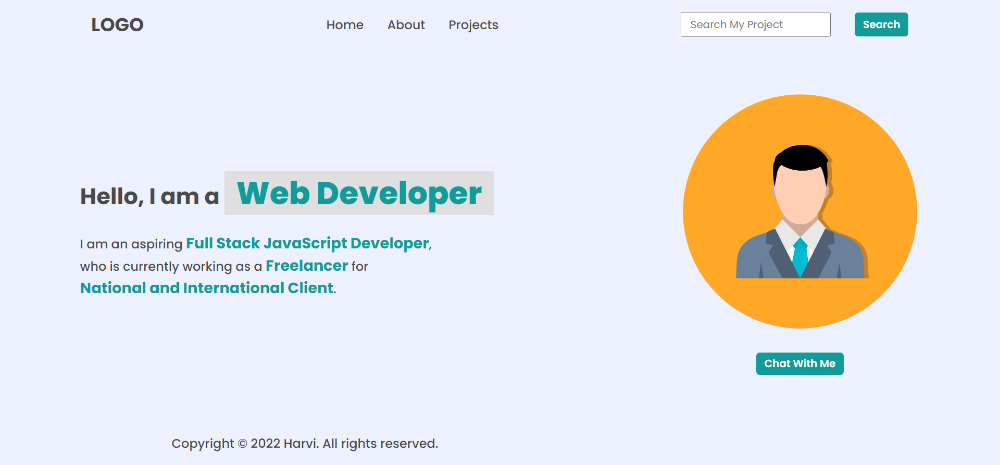

##DOM Assignment

#####Before making any changes what it looks

###Assignment One

#####Task 1: Add a list item on Navbar <mark>"Hire Me"</mark>

######Solution:-

let HireMe=document.createElement("li");
HireMe.innerHTML="<a>Hire Me</a>";
document.querySelector("nav ul").appendChild(HireMe);

#####Task 2: Changed the <mark>Placeholder of search bar</mark>

**Solution:-** 

document.querySelector(".search-field input").placeholder="Search My Project";

