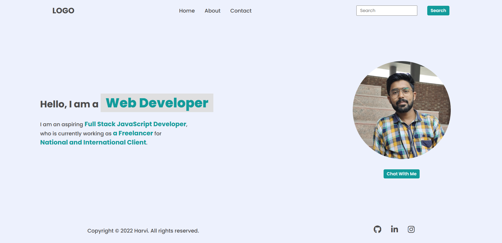
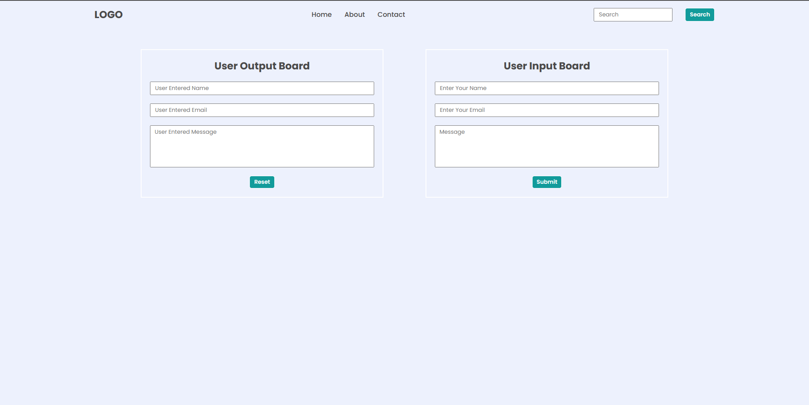

# DOM Assignment

### Before making any changes what it looks


## Assignment One

### Task 1: Add a list item on Navbar <mark>"Hire Me"</mark>


#### Solution:-

```javascript

let HireMe=document.createElement("li");
HireMe.innerHTML="<a>Hire Me</a>";
document.querySelector("nav ul").appendChild(HireMe);

```

### Task 2: Changing the <mark>Placeholder of search bar</mark>


#### Solution:- 

```javascript

document.querySelector(".search-field input").placeholder="Search My Project";

```

### Task 3: Changing the JOB role and Company name in the paragraph


#### Solution:- 

```javascript

let role=document.querySelector(".hero-left-section p :nth-child(3)");
role.innerHTML="An Employee";
let company =document.querySelector(".hero-left-section p :nth-child(5)");
company.innerHTML="iNeuron Intelligence Pvt Ltd";

```

### Task 4: Changing the Profile Picture


#### Solution:- 

```javascript
 
    let dp=document.querySelector(".hero-right-section img");
    dp.src="./Assets/dp.jpg";

```

### Task 5:Adding "Support Me" button After "Chat With Me" Button


#### Solution:- 

```javascript
 
    var button=document.createElement('BUTTON');
    var btnText=document.createTextNode("Support Me");
    button.appendChild(btnText);
    document.querySelector(".hero-right-section-btns").appendChild(button);

```

## Assignment Two

### Task 1: chaning the background color of title and description sections


#### Solution:- 

```javascript

document.querySelectorAll(".accordian h3").forEach((title)=> title.style.backgroundColor="#EAF0F1");
document.querySelectorAll(".accordian p").forEach((description)=> description.style.backgroundColor="#EAF001");

```

### Task 2: Adding one more section "skills" and his description


#### Solution:- 

```javascript

let div=document.createElement('DIV');
let h3=document.createElement('H3');
let p=document.createElement('P');

let titleText=document.createTextNode("Skills");
let desText=document.createTextNode(" I posses a very good command over the full stack development technologies like MERN which can be seen in my work over the GITHUB.");

p.appendChild(titleText);
h3.appendChild(titleText);
p.appendChild(desText);
div.appendChild(h3,p);
div.appendChild(p);
document.querySelector(".accordian-wrapper").appendChild(div);

div.className="accordian";
p.style.display="block";

```


## Assignment Three

## Before making any changes 



### Task 1: Changing the "PlaceHolder"


#### Solution:- 

```javascript

document.querySelector(".enterName").placeholder="FSJS 2.0";
document.querySelector(".userName").placeholder="FSJS 2.0";
document.querySelector(".enterMail").placeholder="fsjs@ineuron.ai";
document.querySelector(".userEmail").placeholder="fsjs@ineuron.ai";
document.querySelector(".enterMessage").placeholder="Hello World";
document.querySelector(".userMessage").placeholder="Hello World";

```