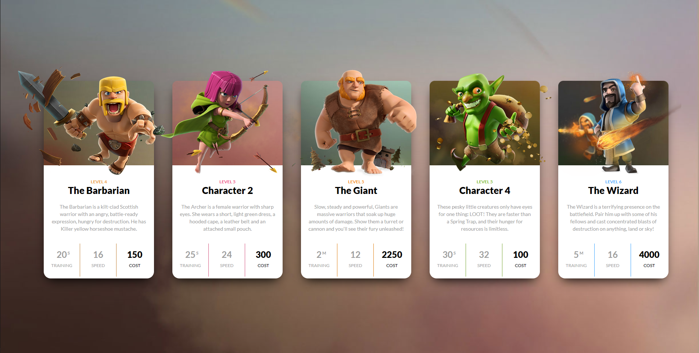
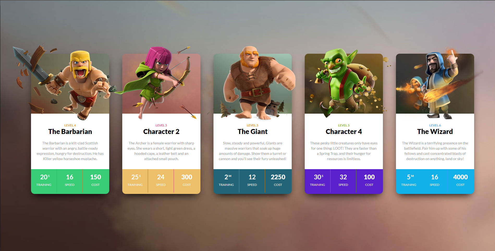

# DOM assignment 4

### Before making Any changes



### Task : Chaning the cards bottam section's backgroudColor and fontColor and also Adding Name of 2nd and 4th character 



#### Solution:- 

```javascript
//Targeting Elements
let colorChange=document.querySelectorAll(".clearfix");
let fontColor=document.querySelectorAll(".one-third");
let secondChar=document.querySelector(".archer :nth-child(3)");
let fourthChar=document.querySelector(".goblin :nth-child(3)");

let colors=["#3944F7","#38CC77","#EDBF69","#236578","#5A20CB","#12B0E8"];

//Changing Colors

let i=1;
colorChange.forEach((color)=> color.style.backgroundColor=colors[i++]);
fontColor.forEach((fc)=> fc.style.color="#ffffff");

// Adding Character Names

secondChar.innerText="The Archer";
fourthChar.innerText="The Goblin";

```