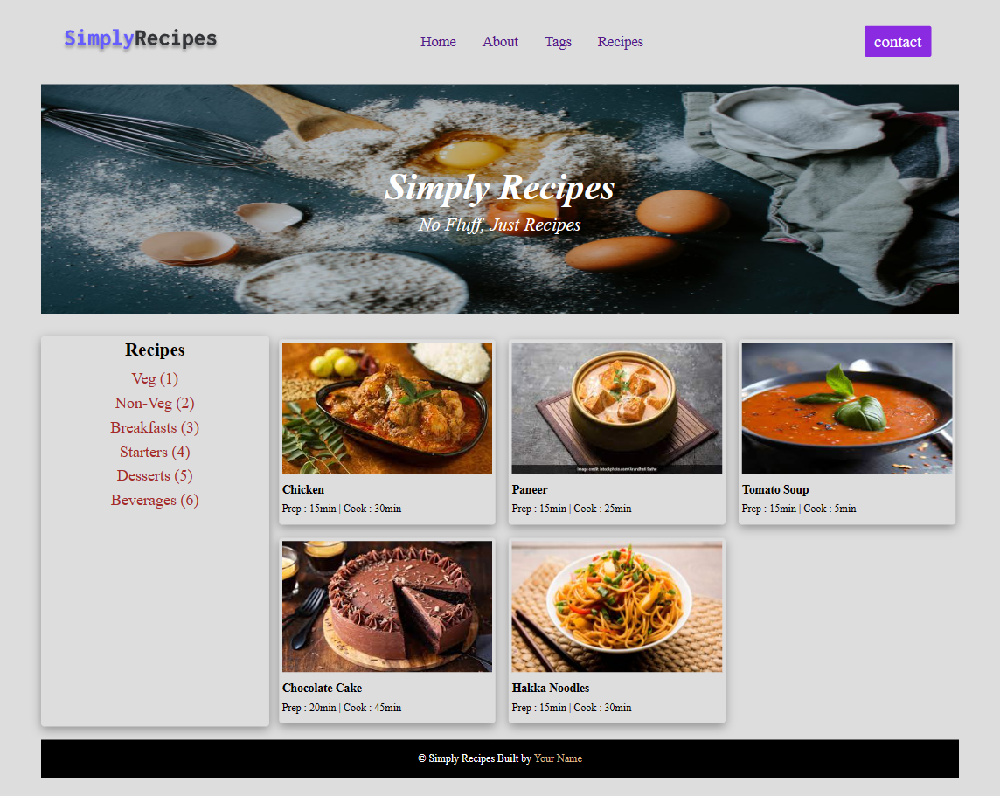
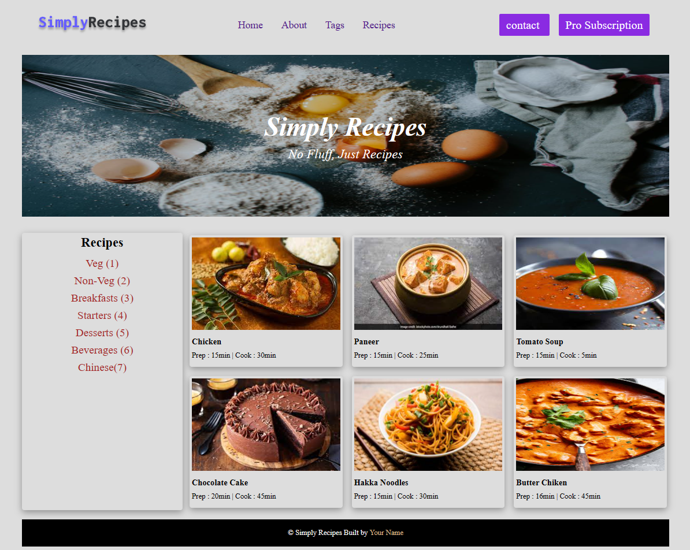

# DOM Assignment 5

### Before making any Changes on the Page




### Task 1 : Adding "Pro Subscription" Button on top left navabr
### Task 2 : Adding One Recipe item "Chinese(7)" in the Recipes Section's bottam
### Task 3 : Adding 6th Card menu "Butter chiken"



#### Solution :-

```javascript

// Creating the ELements

let newBtn=document.createElement('A');
let btnText=document.createTextNode("Pro Subscription");
let newRecipe=document.createElement('A');
let div=document.createElement('DIV');
let img=document.createElement('IMG');
let a=document.createElement('A');
let p=document.createElement('P');
let h5=document.createElement('H5');

// Adding ClassName to the Elements

newBtn.className="btn";
newBtn.href="index.html";
div.className="card";
img.className="recipe-img";
a.className="recipe-text";
h5.className="recipe-name";
p.className="recipe-disp";

// Adding Values to Elements

newRecipe.innerText="Chinese(7)";
img.src="./img/recipe-6.jpeg";
h5.innerText="Butter Chiken";
p.innerText="Prep : 16min | Cook : 45min";

// Adding Sub-Child to the elements

div.appendChild(a);
newBtn.appendChild(btnText);
document.querySelector(".tags-container :nth-child(2)").appendChild(newRecipe);
document.querySelector(".nav-links").nextElementSibling.appendChild(newBtn);
a.appendChild(img);
a.appendChild(h5);
a.appendChild(p);
document.querySelector(".recipe-gallery").appendChild(div);

```