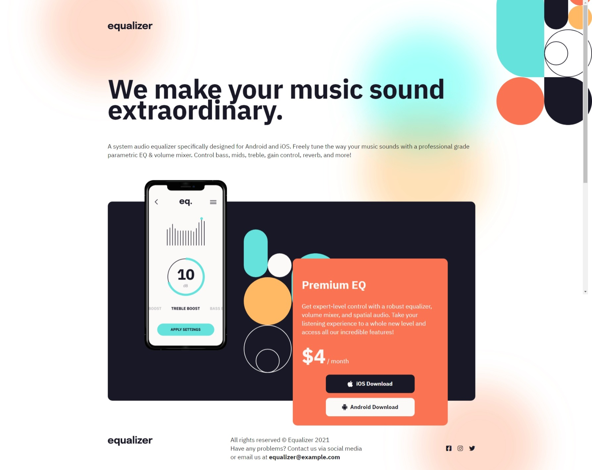

# DOM Assignment 6

## Before



## After 

### Task 1: changing the top icon "Equalizer" to "iNeuron"
### Task 2: chaning the price 4 to 10 
### Task 3: Adding "Linkedin" icon at Footer


#### Solution:- 

```javascript
// changing the LOGO

document.querySelector(".logo").src="./assets/ineuron-logo.png";

// changing the Price

document.querySelector(".app_price span").innerText="$10";

// Adding "LINKEDIN" icon left corner in the footer

let div=document.createElement('DIV');
div.className="footer_social_ico";
let i=document.createElement('I');
i.classList.add("fa-brands", "fa-linkedin");
div.appendChild(i);
document.querySelector(".footer_social").appendChild(div);

```